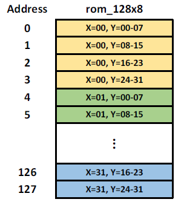

# High_Throughput_Component_Labeling_Engine

## Overview
   This is the final project of Computer-aided VLSI System Design. I designed a Component Labeling Engine (CLE), which can detect object segmentation from the binary image, and give the same ID number to the same object. My design ranked 4th out of 53 graduate student teams. The performance is evaluated with $$Area x Time^2.$$

   

## Statement of the problem

### Block diagram
   The block diagram is shown below. The design is connected with a 128x8 ROM and a 1024x8 SRAM. The ROM stores the input 32x32 image. CLE writes all the labels for the 32x32 image to the 1024x8 SRAM after done processing.

   

### Specifications
   1. Top module name: CLE.
   2. Input/output description:

   

### More details about the problem
   1. The input image is a 32x32 binary image as shown in Fig. 1. For the binary signal, 0 represents the background, and 1 represents the object for each pixel. We have to check if those pixels with value 1 are connected or not. The connected pixels represent to the same object. Those pixels are given with the same label ID from the same object. The number of label ID can be created by ourselves.

   |  |
   |:--:|
   | Fig. 1. Binary Image. |

   |  |
   |:--:|
   | Fig. 2. Actual value for each pixel in binary image. |

   2. The image is already stored in the 128x8 ROM. The storing order is shown in Fig. 3. For example, if the address value is “0”, the corresponding 8-bit binary data represents the pixels [X=00, Y=00-07] in Fig. 2. The MSB is related to [X=00, Y=00], and the LSB is related to [X=00, Y=07]. The number of times to read data from ROM is not constrained, and the signal CEN from ROM is always set to 0.

   |  |
   |:--:|
   | Fig. 3. The storing order for the binary image in ROM. |

   3. The operations in CLE are shown below:

      1. First, CLE has to find the pixel equal to 1 in Fig. 2, which means the object position. Then, it has to identify whether the pixel is connected to other pixels in a 3x3 block. Fig. 4. shows the 8 connecting situations in a 3x3 block. If the pixels are connected, they are seen as the same object. Otherwise, the pixels which are not connected are seen as different object.

      |  |
      |:--:|
      | Fig. 4. The 8 connecting situations in a 3x3 block. |

      2. Every pixel is required to be set with the same label ID for the same object. We can decide the number of label ID by ourselves with the following naming rules:

         1. The number of label ID range we can use: 8’h01~8’hFB
         2. The number 8’h00 is for background. We can’t give this number to object.
         3. Label ID cannot be reused for different object.

   4. Fig. 5 shows the example result after processing on Fig.2. Five label IDs are used in this example. All labels for the 32x32 image are required to be stored in the outside SRAM (the sram_1024x8 is not included in CLE). The storing method is shown in Fig. 6. For example, the address value “0” stores the label for pixel [X=00, Y=00], and so on. If all labels are stored in sram_1024x8, CLE sets output “finish” to high, and the testbench will check the answer.

   |  |
   |:--:|
   | Fig. 5. Labels for each pixel to store in SRAM. |

   |  |
   |:--:|
   | Fig. 6. The storing order for the 8-bit label in SRAM. |