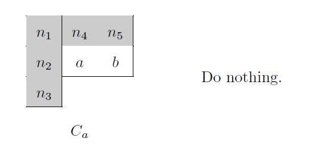

# High_Throughput_Component_Labeling_Engine

## Table of contents

<!--ts-->
   * [Introduction to this project](#introduction-to-this-project)
   * [Files in this repository](#files-in-this-repository)
   * [Statement of the problem](#statement-of-the-problem)
      * [Block diagram](#block-diagram)
      * [Specifications](#specifications)
      * [More details about the problem](#more-details-about-the-problem)
      * [Memories for design](#memories-for-design)
   * [Implementation](#implementation)
      * [The software algorithm this project refers to](#the-software-algorithm-this-project-refers-to)
      * [Overview of the CLE](#overview-of-the-cle)
      * [Mask for the first scan](#mask-for-the-first-scan)
      * [Labeling and transition in the nine configurations](#labeling-and-transition-in-the-nine-configurations)
         * [*Ca*](#ca)
         * [*Cb*](#cb)
         * [*Cc*](#cc)
         * [*Cd*](#cd)
         * [*Ce*](#ce)
         * [*Cf*](#cf)
         * [*Cg*](#cg)
         * [*Ch*](#ch)
         * [*Ci*](#ci)
      * [Merging different labels](#merging-different-labels)
   * [Reference](#reference)
<!--te-->

## Introduction to this project
   This is the final project of Computer-aided VLSI System Design. I designed a Component Labeling Engine (CLE), which can detect object segmentation from the binary image, and give the same ID number to the same object. This design ranked 4th out of 53 graduate student teams. The performance is evaluated with $$Area \times Time^2.$$

   |  |
   |:--:|
   | Fig. 1. Transformation performed by CLE. |

## Files in this repository

   The code of CLE is [CLE.v](./src/CLE.v). Although I implemented CLE from its frontend RTL code and gate-level to the backend of place and route in this project, the non-disclosure agreement forbids me from revealing anything about the cell library. As a result, only the RTL code is included in this repository.

## Statement of the problem

### Block diagram
   The block diagram is shown below. The design is connected with a 128x8 ROM and a 1024x8 SRAM. The ROM stores the input 32x32 image. CLE writes all the labels for the 32x32 image to the 1024x8 SRAM after being done processing.

   |  |
   |:--:|
   | Fig. 2. Block diagram |

### Specifications

   The description of the inputs and the outputs is shown below:

   |  |
   |:--:|
   | Fig. 3. Specifications |

### More details about the problem
   1. The input image is a 32x32 binary image as shown in Fig. 4. For the binary signal, 0 represents the background pixel, and 1 represents the foreground pixel. We have to check if those foreground pixels are connected or not. Connected foreground pixels must be given the same label ID. The number of label IDs can be created by ourselves.

   |  |
   |:--:|
   | Fig. 4. Binary Image. |

   |  |
   |:--:|
   | Fig. 5. Actual value for each pixel in the binary image. |

   2. The image is already stored in the 128x8 ROM. The storing order is shown in Fig. 6. For example, if the address value is “0”, the corresponding 8-bit binary data represents the pixels [X=00, Y=00-07] in Fig. 5. The MSB is related to [X=00, Y=00], and the LSB is related to [X=00, Y=07]. The number of times to read data from ROM is not constrained, and the signal CEN from ROM is always set to 0.

   |  |
   |:--:|
   | Fig. 6. The storing order for the binary image in ROM. |

   3. The operations in CLE are shown below:

      1. First, CLE has to find the pixel equal to 1 in Fig. 5, which means the object position. Then, it has to identify whether the pixel is connected to other pixels in a 3x3 block. Fig. 7. shows the 8 connecting situations in a 3x3 block. If the pixels are connected, they are seen as the same object. Otherwise, the pixels which are not connected are seen as different objects.

      |  |
      |:--:|
      | Fig. 7. The 8 connecting situations in a 3x3 block. |

      2. Every pixel is required to be set with the same label ID for the same object. We can decide the number of label IDs by ourselves with the following naming rules:

         1. The number of label ID range we can use: 8’h01~8’hFB
         2. The number 8’h00 is for background. We can’t give this number to the object.
         3. A label ID cannot be reused for different objects.

   4. Fig. 8 shows the example result after processing on Fig.5. Five label IDs are used in this example. All labels for the 32x32 image are required to be stored in the outside SRAM (the sram_1024x8 is not included in CLE). The storing method is shown in Fig. 9. For example, the address value “0” stores the label for pixel [X=00, Y=00], and so on. If all labels are stored in sram_1024x8, CLE sets output “finish” to high, and the testbench will check the answer.

   |  |
   |:--:|
   | Fig. 8. Labels for each pixel to store in SRAM. |

   |  |
   |:--:|
   | Fig. 9. The storing order for the 8-bit label in SRAM. |

### Memories for design

   1. We can use these three kinds of memories in our design:
      1. 256x8 SRAM
      2. 512x8 SRAM
      3. 4096x8 SRAM
   2. We can not use 1024x8 SRAM in our design.

## Implementation

### The software algorithm this project refers to
   The software algorithm of this project is based on the paper ["Configuration-Transition-Based Connected-Component Labeling"](https://ieeexplore.ieee.org/document/6657807). Unlike the [conventional two-pass labeling algorithm](https://en.wikipedia.org/wiki/Connected-component_labeling#Two-pass) which scan image lines one by one and process pixels one by one, this algorithm processes pixels two by two. This project implements a CLE on hardware based on this algorithm. With the characteristic of this algorithm, the throughput of the first scan increases by two, and the performance is improved by four based on the AT2 metric.

### Overview of the CLE

   This CLE performs two scans. In the first scan, we label pixels from top to down, from left to right (unlike the software algorithm in the paper that scans from left to right, from top to down). This is because we can read two pixels in the same row from the 128x8 ROM in the same cycle. The background pixels are always assigned with 0. For foreground pixels, we not only assign a label to each pixel but also assign a representative to each label. For the labels having the same representative, pixels with these labels belong to the same connected component. Therefore, when we find out that two labels turn out to belong to the same connected component during the scan, we just assign the representative of one label to the representative of the other label. We write the label of each pixel to two 512x8 SRAMs. Additionally, we maintain a register file called *merge_table* to store each representative. The final label of each pixel is the representative of the label of the pixel (instead of the label of the pixel). Therefore, in the second scan, we read the label of the pixel from one of the 512x8 SRAMs, looking up its representative in *merge_table*, and writing the representative of the label of the pixel to 1024x8 SRAM.

### Mask for the first scan

   The CLE uses the mask as shown in Fig. 10. Pixel *n1*, *n2*, *n3*, *n4*, and *n5* have been assigned with their labels, while pixel *a* and pixel *b* are the pixels we are processing. There are four cases for a pixel in the masks. A background pixel is denoted by a white square. A meaningless pixel is denoted by a light gray square. Whether a meaningless pixel is a foreground pixel does not affect the processing result. A pixel that is either a foreground pixel or a background pixel is denoted by a dark gray square. A foreground pixel is denoted by a black square.

   |  |
   |:--:|
   | Fig. 10. An example of a mask. |

### Labeling and transition in the nine configurations

   There are nine configurations of the masks, which are *Ca*, *Cb*, *Cc*, *Cd*, *Cf*, *Cg*, *Ch*, and *Ci*, . We assign the labels to the pixels according to the current configurations and the labels of *n1*, *n2*, *n3*, *n4*, and *n5*. In addition, the transitions of the configurations are based on the current configurations
   and the values of pixel *n2*, *n3*, *a*, *b*, and the next *a* and *b* (i.e. the pixels at the bottom and the bottom right in a 3x3 pixel block). Fig. 11 to Fig. 28 shows how pixel *a* and pixel *b* are labeled and merged (if necessary) and the transition of the configuration in the nine configurations. The details of labeling and transition in the nine configurations are shown below.

#### *Ca*

##### Labeling

   1. 

   

##### Transition

   1. 

   

#### *Cb*

##### Labeling

   1. 

   

   2. 

   

   3. 

   

   4. 

   

   5. 

   

##### Transition

   1. 

   

   2. 

   

   3. 

   

#### *Cc*

##### Labeling

   1. 

   

##### Transition

   1. 

   

#### *Cd*

##### Labeling

   1. 

   

   2. 

   

   3. 

   

##### Transition

   1. 

   

   2. 

   

   3. 

   

#### *Ce*

##### Labeling

   1. 

   

##### Transition

   1. 

   

#### *Cf*

##### Labeling

   1. 

   

   2. 

   

##### Transition

   1. 

   

   2. 

   

#### *Cg*

##### Labeling

   1. 

   

##### Transition

   1. 

   

#### *Ch*

##### Labeling

   1. 

   

   2. 

   

   3. 

   

   4. 

   

   5. 

   

##### Transition

   1. 

   

   2. 

   

   3. 

   

#### *Ci*

##### Labeling

   1. 

   

##### Transition

   1. 

   

### Merging different labels

   1. When we are scanning, we may find out that two pixels that were assigned with different labels actually belong to the same connected component. In this case, we need to merge these labels.
   2. We merge different labels by assigning the representative of one of the labels to the representative of the other label. To achieve it, we maintain a register file called *merge_table*. Suppose that the labels we are merging are *la* and *lb*, and their representatives are *ra* and *rb* respectively. We write ***merge_table[la] = rb.*** Thus, the representative of *la* is *rb* now.It also works if we update *ra* to be *rb*.

## Reference

   [Configuration-Transition-Based Connected-Component Labeling](https://ieeexplore.ieee.org/document/6657807)